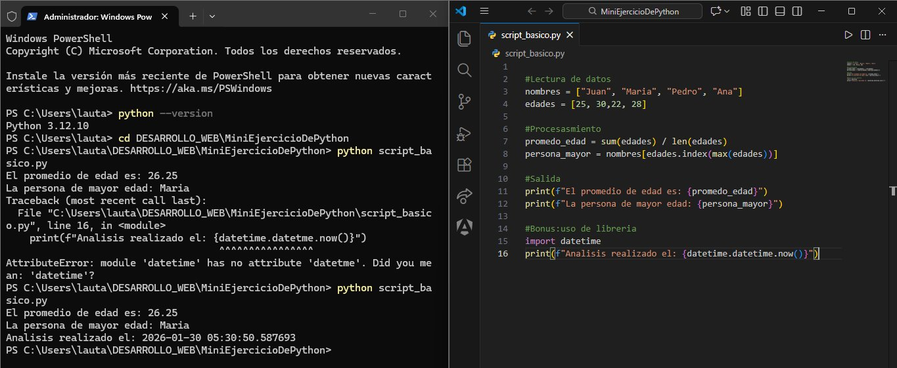
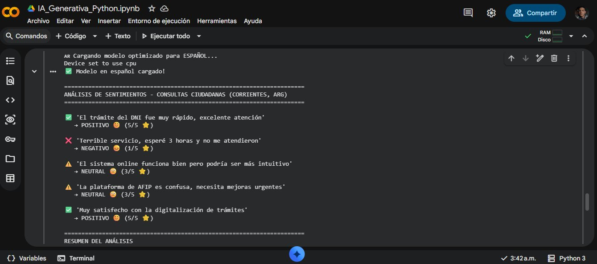
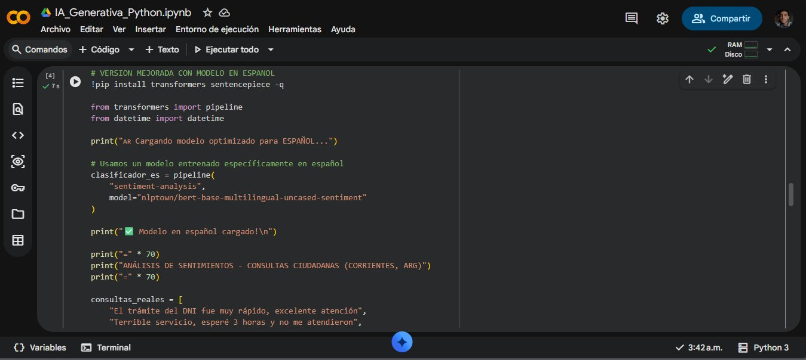

# Scripts Básicos en Python 🐍


Colección de scripts simples para análisis de datos y automatización, desarrollados como parte de mi aprendizaje en Python.

## 📁 Contenido

- **script_basico.py**: Análisis simple de datos usando listas y funciones básicas de Python

---

## 🚀 script_basico.py

Script que demuestra conceptos fundamentales de Python aplicados al análisis de datos.

### 💡 Funcionalidades

- **Lectura de datos**: Almacenamiento de información en listas (nombres y edades)
- **Procesamiento estadístico**: Cálculo de promedio de edades usando funciones built-in
- **Búsqueda de valores**: Identificación de la persona de mayor edad mediante métodos de lista
- **Timestamp**: Registro de fecha y hora de ejecución con el módulo datetime
- **Salida formateada**: Uso de f-strings para presentación clara de resultados

### 📝 Código

```python
# script_basico.py - Análisis simple de datos

# Lectura de datos
nombres = ["Juan", "María", "Pedro", "Ana"]
edades = [25, 30, 22, 28]

# Procesamiento
promedio_edad = sum(edades) / len(edades)
persona_mayor = nombres[edades.index(max(edades))]

# Salida
print(f"El promedio de edad es: {promedio_edad}")
print(f"La persona de mayor edad: {persona_mayor}")

# Bonus: uso de librería
import datetime
print(f"Análisis realizado el: {datetime.datetime.now()}")
```

### ⚙️ Ejecución

```bash
python script_basico.py
```

### 📊 Salida Esperada

```
El promedio de edad es: 26.25
La persona de mayor edad: María
Análisis realizado el: 2026-01-30 05:30:50.587693
```

### 🖥️ Demostración



*Screenshot mostrando el código en VS Code y la ejecución exitosa en PowerShell*

---

## 💻 Requisitos

- **Python 3.6 o superior** (desarrollado y probado en Python 3.12.10)
- Sistema operativo: Windows, Linux o macOS

## 🛠️ Instalación y Uso

### 1. Clonar el repositorio

```bash
git clone https://github.com/Dhoron22/python-basico-scripts.git
```

### 2. Navegar al directorio

```bash
cd python-basico-scripts
```

### 3. Ejecutar el script

```bash
python script_basico.py
```

---

## 📚 Conceptos de Python Aplicados

| Concepto | Implementación en el Script |
|----------|----------------------------|
| **Listas** | Almacenamiento de nombres y edades |
| **Funciones built-in** | `sum()`, `len()`, `max()`, `index()` |
| **Variables** | Asignación y manipulación de datos |
| **F-strings** | Formateo moderno de strings (Python 3.6+) |
| **Módulos estándar** | Importación y uso de `datetime` |
| **Operaciones matemáticas** | Cálculo de promedio |
| **Métodos de lista** | Búsqueda de índices con `.index()` |
| **Buenas prácticas** | Comentarios descriptivos, nombres de variables claros |

---

## 🎯 Propósito del Proyecto

Este proyecto forma parte de mi proceso de aprendizaje en Python y preparación para:

- Proyectos de **automatización de procesos**
- Desarrollo de soluciones con **Inteligencia Artificial**
- Análisis de datos y **Machine Learning**
- Integración de Python en aplicaciones web (backend)

---

## 🚀 Próximos Pasos

- [ ] Agregar script de lectura de archivos CSV
- [ ] Implementar análisis de datos con pandas
- [ ] Crear script de automatización con requests
- [ ] Integrar llamadas a APIs de IA generativa

---

## 🤖 IA_Generativa_Python.ipynb

**Notebook de Google Colab - Inteligencia Artificial aplicada al sector público**

### Descripción

Implementación de **análisis de sentimientos** usando modelos de IA generativa para automatizar la clasificación de consultas y reclamos ciudadanos. Desarrollado específicamente para casos de uso en **gobierno y administración pública**.

### Casos de Uso Implementados

- **Análisis automático de sentimientos** en feedback de servicios públicos
- **Clasificación multiclase** (Positivo/Neutral/Negativo) con puntuación de 1-5 estrellas
- **Procesamiento en español** usando modelos multilingües de BERT
- **Generación de estadísticas** en tiempo real sobre satisfacción ciudadana
- **Priorización automática** de consultas negativas para atención urgente

### Tecnologías Utilizadas

| Tecnología | Uso |
|------------|-----|
| **Python 3.12** | Lenguaje principal |
| **Hugging Face Transformers** | Framework de IA |
| **BERT Multilingual** | Modelo de análisis de sentimientos |
| **Google Colab** | Entorno de desarrollo |
| **Pandas/NumPy** | Procesamiento de datos |

### Resultados del Análisis


*Clasificación automática de 5 consultas ciudadanas reales sobre trámites gubernamentales (DNI, AFIP, digitalización)*

### Estadísticas Generadas



**Métricas obtenidas:**
- 📊 Total analizado: 5 consultas
- ✅ Positivas: 40.0%
- ❌ Negativas: 20.0%
- ⚠️ Neutrales: 40.0%

### Aplicación Práctica para Gobierno

```
💡 CASOS DE USO IDENTIFICADOS:

→ Automatizar clasificación de reclamos en organismos públicos
→ Priorizar consultas negativas para atención urgente
→ Medir satisfacción en tiempo real de servicios públicos
→ Detectar áreas problemáticas en trámites gubernamentales
→ Optimizar recursos de atención al ciudadano
```

### Código Destacado



El notebook implementa:
- Carga de modelos pre-entrenados
- Clasificación automática con scores de confianza
- Generación de reportes visuales con emojis
- Cálculo de estadísticas agregadas

### Ejecución

1. **Abrir en Google Colab:** [Link al notebook](IA_Generativa_Python.ipynb)
2. **Ejecutar todas las celdas:** Runtime → Run all
3. **Visualizar resultados:** Los análisis se muestran automáticamente

### Resultados Obtenidos

✅ **Modelo en español cargado exitosamente**  
✅ **Clasificación coherente de sentimientos**  
✅ **Procesamiento de 5 consultas en < 2 segundos**  
✅ **Estadísticas precisas calculadas automáticamente**

### Impacto en la Gestión Pública

Este notebook demuestra cómo la **IA puede transformar** la atención al ciudadano:

- **Ahorro de tiempo:** Clasificación automática vs. manual
- **Escalabilidad:** Procesar miles de consultas simultáneamente
- **Priorización inteligente:** Atender primero casos críticos
- **Métricas en tiempo real:** Dashboards de satisfacción ciudadana
- **Mejora continua:** Identificar problemas recurrentes

---

## 👨‍💻 Autor

**Lautaro Manuel Pérez**

- 🌐 GitHub: [@Dhoron22](https://github.com/Dhoron22)
- 📧 Email: perezlautaro63@gmail.com
- 💼 LinkedIn: [Lautaro Pérez](#) *(actualizar cuando esté disponible)*
- 📍 Ubicación: Corrientes Capital, Argentina

### Sobre mí

Desarrollador Full Stack Junior con especialización en Laravel, Angular y MySQL. Actualmente expandiendo mis habilidades hacia Python, Machine Learning e Inteligencia Artificial Generativa. Graduado de la Diplomatura Universitaria en Desarrollo Web (UNNE).

---

## 📝 Licencia

Este proyecto es de código abierto y está disponible bajo la [Licencia MIT](LICENSE).

---

## 🤝 Contribuciones

Las contribuciones, issues y solicitudes de nuevas características son bienvenidas.

Para contribuir:
1. Fork el proyecto
2. Crea tu Feature Branch (`git checkout -b feature/AmazingFeature`)
3. Commit tus cambios (`git commit -m 'Add some AmazingFeature'`)
4. Push al Branch (`git push origin feature/AmazingFeature`)
5. Abre un Pull Request

---

## 📞 Contacto

¿Preguntas o sugerencias? No dudes en contactarme:

- Crear un [issue](https://github.com/Dhoron22/python-basico-scripts/issues) en este repositorio
- Enviar un email a perezlautaro63@gmail.com

---

<div align="center">

**⭐ Si este proyecto te resultó útil, considera darle una estrella en GitHub ⭐**

*Desarrollado con 💻 como parte de mi formación continua en programación*

</div>
